# System Architecture — RAG Codebase Assistant

This document details the system architecture and data flow of the RAG-based GitHub Codebase Assistant.

---

## Minimal Architecture (Quick Overview)

```mermaid
graph LR
    User["👤 User"]
    Frontend["⚛️ React<br/>Frontend"]
    Backend["🔌 FastAPI<br/>Backend"]
    Chroma["🗄️ Chroma<br/>Vector DB"]
    Gemini["🌐 Gemini<br/>LLM"]
  
    User -->|Chat| Frontend
    Frontend -->|Query| Backend
    Backend -->|Embed| Chroma
    Backend -->|Prompt| Gemini
    Gemini -->|Answer| Backend
    Backend -->|Response| Frontend
    Frontend -->|Display| User
```

---

## High-Level Architecture Diagram

```mermaid
graph TB
    User["👤 User<br/>(Browser)"]
    Frontend["⚛️ Frontend<br/>(React + Vite)<br/>localhost:5173"]
    API["🔌 Backend API<br/>(FastAPI)<br/>localhost:8000"]
    Loader["📂 Repo Loader<br/>(repo_loader.py)"]
    Chunker["✂️ Chunker<br/>(Split Code)"]
    EmbeddingModel["🧠 Embedding Model<br/>(sentence-transformers)"]
    VectorDB["🗄️ Vector Database<br/>(Chroma)"]
    Retriever["🔍 Retriever<br/>(Similarity Search)"]
    LLMChain["🔗 LLM Chain<br/>(LangChain)"]
    LLMProvider["🌐 LLM Provider<br/>(Google Gemini)"]
    Response["✅ Grounded Response<br/>(with file refs)"]

    User -->|Ask Question| Frontend
    Frontend -->|HTTP Request| API
  
    API -->|Index Repo| Loader
    Loader -->|Raw Code Files| Chunker
    Chunker -->|Code Chunks| EmbeddingModel
    EmbeddingModel -->|Dense Vectors| VectorDB
  
    API -->|User Query| EmbeddingModel
    EmbeddingModel -->|Query Vector| Retriever
    Retriever -->|Top-K Chunks| VectorDB
    Retriever -->|Retrieved Context| LLMChain
    LLMChain -->|Prompt| LLMProvider
    LLMProvider -->|Generated Text| LLMChain
    LLMChain -->|Answer| Response
    Response -->|HTTP Response| Frontend
    Frontend -->|Display Answer| User
```

---

## Detailed Component Diagram

---

## Activity Diagram (User Workflows)

---

## Data Flow: Indexing a Repository

---

## Data Flow: Chat (Query & Answer)

---

## File Structure & Module Map

---

## Class Diagram (Mermaid)

