# System Architecture — RAG Codebase Assistant

This document details the system architecture and data flow of the RAG-based GitHub Codebase Assistant.

---

## Minimal Architecture (Quick Overview)

```mermaid
graph LR
    User["👤 User"]
    Frontend["⚛️ React<br/>Frontend"]
    Backend["🔌 FastAPI<br/>Backend"]
    Chroma["🗄️ Chroma<br/>Vector DB"]
    Gemini["🌐 Gemini<br/>LLM"]
  
    User -->|Chat| Frontend
    Frontend -->|Query| Backend
    Backend -->|Embed| Chroma
    Backend -->|Prompt| Gemini
    Gemini -->|Answer| Backend
    Backend -->|Response| Frontend
    Frontend -->|Display| User
```



---

## High-Level Architecture Diagram

```mermaid
graph TB
    User["👤 User<br/>(Browser)"]
    Frontend["⚛️ Frontend<br/>(React + Vite)<br/>localhost:5173"]
    API["🔌 Backend API<br/>(FastAPI)<br/>localhost:8000"]
    Loader["📂 Repo Loader<br/>(repo_loader.py)"]
    Chunker["✂️ Chunker<br/>(Split Code)"]
    EmbeddingModel["🧠 Embedding Model<br/>(sentence-transformers)"]
    VectorDB["🗄️ Vector Database<br/>(Chroma)"]
    Retriever["🔍 Retriever<br/>(Similarity Search)"]
    LLMChain["🔗 LLM Chain<br/>(LangChain)"]
    LLMProvider["🌐 LLM Provider<br/>(Google Gemini)"]
    Response["✅ Grounded Response<br/>(with file refs)"]

    User -->|Ask Question| Frontend
    Frontend -->|HTTP Request| API
  
    API -->|Index Repo| Loader
    Loader -->|Raw Code Files| Chunker
    Chunker -->|Code Chunks| EmbeddingModel
    EmbeddingModel -->|Dense Vectors| VectorDB
  
    API -->|User Query| EmbeddingModel
    EmbeddingModel -->|Query Vector| Retriever
    Retriever -->|Top-K Chunks| VectorDB
    Retriever -->|Retrieved Context| LLMChain
    LLMChain -->|Prompt| LLMProvider
    LLMProvider -->|Generated Text| LLMChain
    LLMChain -->|Answer| Response
    Response -->|HTTP Response| Frontend
    Frontend -->|Display Answer| User
```



---

## Detailed Component Diagram


---

## Data Flow: Indexing a Repository


---

## Data Flow: Chat (Query & Answer)


---

## File Structure & Module Map


---

## Technology Stack Overview

### Frontend

- **React**: UI framework for interactive chat interface
- **Vite**: Lightning-fast build tool & dev server
- **Styling**: CSS for layout and theming

### Backend

- **FastAPI**: High-performance Python async API framework
- **Python 3.9+**: Language runtime

### AI/ML Components

- **LangChain**: Orchestrates RAG pipeline, prompts, and LLM chains
- **Sentence-Transformers** (all-MiniLM-L6-v2): Converts text to 384-dimensional embeddings
- **Google Gemini**: LLM for generating grounded answers
- **Chroma**: Vector database for persistent embedding storage and retrieval

### Containerization & Deployment

- **Docker**: Containerizes frontend and backend
- **Docker Compose**: Orchestrates multi-container local environment

---

## RAG Pipeline: Step-by-Step

1. **Repository Input**

   - User provides GitHub repository URL
   - Backend clones repo using `repo_loader.py`
2. **Code Parsing & Chunking**

   - Extract source files (`.py`, `.js`, `.ts`, `.md`, etc.)
   - Split into semantic chunks (maintains context, ~500 tokens/chunk)
   - Preserve file path, line number metadata
3. **Embedding Generation**

   - Each chunk → sentence-transformers model
   - Output: 384-dimensional dense vectors
4. **Vector Storage**

   - Vectors stored in Chroma with metadata
   - Chroma builds HNSW index for fast retrieval
5. **Query Processing**

   - User question → embed using same model
   - Query vector → similarity search in Chroma
6. **Context Retrieval**

   - Top-k chunks (default: 5-10) ranked by cosine similarity
   - Preserve file path + line numbers for sources
7. **Prompt Construction**

   - Build RAG prompt: `{question} + {context} → answer`
   - Use LangChain to orchestrate
8. **LLM Generation**

   - Send prompt to Google Gemini
   - Receive generated answer
9. **Response Assembly**

   - Return answer + source references (file, line #)
   - Frontend displays grounded response

---

## API Contract

### POST /index-repo

```json
Request:  { "repo_url": "https://github.com/user/repo" }
Response: { "status": "success", "message": "..." }
```

### POST /chat

```json
Request:  { "question": "How does authentication work?" }
Response: { 
  "answer": "...",
  "sources": [
    { "file": "backend/auth.py", "line": 42 },
    { "file": "backend/utils.py", "line": 88 }
  ]
}
```

---

## Performance & Scalability Notes

- **Embeddings**: Cached in memory and persisted in Chroma (~instant retrieval)
- **Chunking**: Semantic splitting maintains context while controlling chunk size
- **Retrieval**: HNSW index in Chroma provides O(log n) search time
- **LLM Latency**: Dominant factor; typically 2-5 seconds for answer generation
- **Scalability**: Can handle 1000s of code files; Chroma scales to millions of embeddings

---

## Development Workflow

1. **Local Setup**: Run backend + frontend locally with hot-reload
2. **Testing**: Index a test repo, ask questions, iterate
3. **Docker Build**: Use `docker-compose up` for containerized stack
4. **Production**: Deploy backend to cloud (AppEngine, Azure, etc.), frontend to CDN

---

## Future Enhancements

- Hybrid search (keyword + semantic)
- Multi-language support
- Fine-tuned embeddings for code
- Streaming responses
- User query logging & analytics
