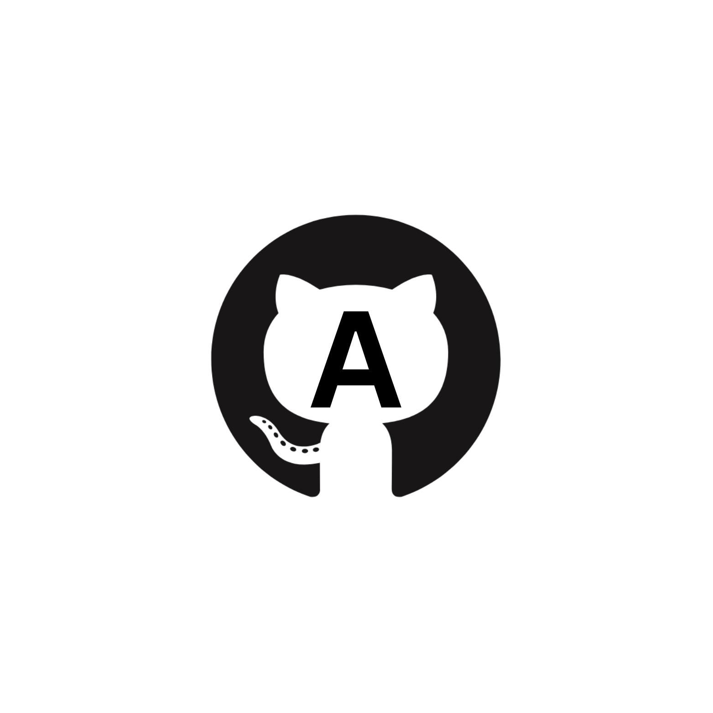
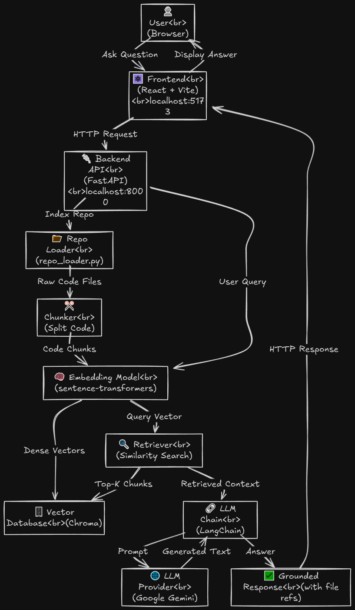
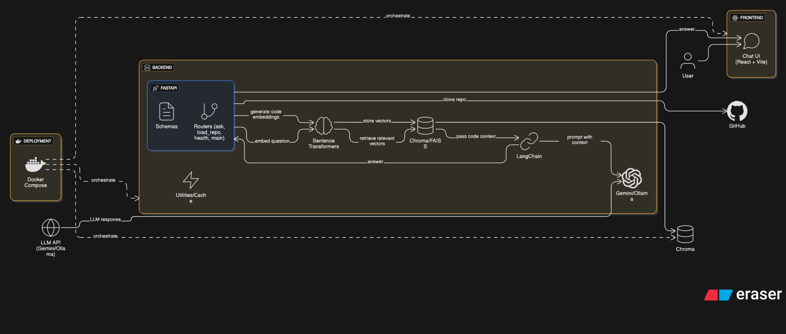

# 🧠💬 GitHub Codebase Assistant (gita)

A powerful chat-based AI assistant for deeply understanding and navigating GitHub repositories using Retrieval-Augmented Generation (RAG).

# Logo

<div align="center">
  
</div>

[](https://opensource.org/licenses/MIT)
[](https://www.python.org/downloads/)
[](https://nodejs.org/)
[](https://www.docker.com/)

---

## 🚀 What This Project Does (gita)

This tool allows developers to **ask questions about any codebase** and get reliable, context-aware answers grounded only in the repository's source files. Built on a **Retrieval-Augmented Generation (RAG)** architecture, it eliminates hallucinations and provides high-fidelity technical insights with exact file references.

### ✨ Core Features

- **🔗 Clone & Index** — Clones any public GitHub repository for processing
- **🧠 Deep Understanding** — Parses and chunks source code files for granular comprehension
- **📊 Vectorized Knowledge** — Generates embeddings for code snippets using state-of-the-art models
- **🎯 Precision Retrieval** — Retrieves the most relevant code snippets for each question
- **💬 Context-Aware Chat** — Interact with the codebase through natural conversation
- **✅ Grounded Responses** — Responses are guaranteed to be based *only* on provided source code
- **📝 Exact References** — Get file references and line numbers alongside every answer
- **⚡ Performance Optimized** — Vector caching and efficient indexing for fast responses

---

## 🏗️ Architecture

The system follows a modern microservices architecture with clear separation of concerns:

<div align="center">
  
</div>
<div align="center">
  
</div>

### Key Components

- **Frontend**: React + Vite for a modern, responsive chat interface
- **Backend**: FastAPI for high-performance REST API
- **Vector Store**: Chroma for persistent code embeddings
- **LLM**: Google Gemini for context-aware answer generation
- **Embeddings**: Sentence Transformers for semantic code representation

---

## 🧩 Tech Stack

| Component                   | Technology                             | Purpose                                        |
| --------------------------- | -------------------------------------- | ---------------------------------------------- |
| **Frontend**          | ⚛️ React + ⚡ Vite                   | Modern chat UI with real-time interactions     |
| **Backend**           | 🚀 FastAPI (Python)                    | High-performance REST API for indexing and Q&A |
| **Vector DB**         | 🗄️ Chroma                            | Persistent storage for code embeddings         |
| **LLM Orchestration** | 🔗 LangChain                           | RAG pipeline management and prompting          |
| **Language Model**    | 🌐 Google Gemini(docker)/Ollama(local) | Core AI model for generating answers           |
| **Embedding Model**   | 🧠 all-MiniLM-L6-v2                    | Vector representations of code snippets        |
| **Containerization**  | 🐳 Docker Compose                      | Orchestrated multi-container deployment        |

---

## 📋 Prerequisites

Before you begin, ensure you have the following installed:

- **Python 3.9+** for backend development
- **Node.js 16+** for frontend development
- **Docker & Docker Compose** for containerized deployment
- **Git** for repository cloning
- **Google Gemini API Key** ([Get yours here](https://makersuite.google.com/app/apikey))
- **In host setup** Ollama:llama3:latest

---

## ⚡ Quick Start

### Option 1: Docker Compose (Recommended)

The fastest way to get started:

```bash
# Clone the repository
git clone https://github.com/amineelgardoum-rgb/github_assistant.git
cd github_assistant
# add the .env file 
# Start all services
make up
```

The application will be available at:

- **Frontend**: http://localhost:5173
- **Backend API**: http://localhost:8000
- **API Docs**: http://localhost:8000/docs

### Option 2: Manual Setup

<details>
<summary>Click to expand manual setup instructions</summary>

#### Backend Setup

```bash
## Navigate to backend directory
cd backend

# Create virtual environment
python -m venv venv

# Activate virtual environment
# On Windows:
venv\Scripts\activate
# On macOS/Linux:
source venv/bin/activate

# Install dependencies
pip install -r requirements.txt

# run the ollama server
ollama serve

# Start backend server
uvicorn main:app --reload --host 0.0.0.0 --port 8000
```

#### Frontend Setup

```bash
# Navigate to frontend directory
cd frontend

# Install dependencies
npm install

# Start development server
npm run dev
```

</details>

---

## 🛠️ Make Commands

The project includes convenient Make commands for Docker operations:

```bash
make up            # Build and start all services in background
make down          # Stop all services and remove volumes
make logs          # View logs from all services (follow mode)
make backendLogs   # View backend service logs only
make frontendLogs  # View frontend service logs only
make restart       # Restart all services
make clean         # Remove all containers, volumes, and images
```

---

## 📂 Project Structure

```
github_assistant/
├── backend/                      # Python FastAPI backend
│   ├── api/                      # API layer
│   │   ├── routers/              # API endpoints
│   │   │   ├── ask_router.py     # /ask endpoint for Q&A
│   │   │   ├── load_repo_router.py # /load endpoint for indexing
|   |   |   ├── health_router.py    # health endpoint 
|   |   |   └── main_router         # endpoint for the /
│   │   ├── schemas/              # Pydantic validation models
│   │   │   ├── askRequest.py     # Ask request schema
│   │   │   └── loadRequest.py    # Load request schema
│   │   └── vector_cache.py       # Vector store caching
│   ├── embeddings/               # Embedding generation
│   │   └── vector_store.py       # FAISS/Chroma vector store
│   ├── llm/                      # LLM integration
│   │   └── llm_chain.py          # RAG chain setup
│   ├── loaders/                  # Document loading
│   │   └── repo_loader.py        # Git repository loader
│   ├── utils/                    # Utilities
│   │   └── retriever_utils.py    # Retrieval helpers
│   ├── docker/
│   │   └── Dockerfile            # Backend container definition
│   ├── main.py                   # FastAPI application entry
│   ├── requirements.txt          # Python dependencies
│   └── README.md                 # Backend documentation
│
├── frontend/                     # React + Vite frontend
│   ├── src/
│   │   ├── components/           # React components
│   │   │   ├── ChatPage.jsx      # Chat interface
│   │   │   ├── Landing.jsx       # Landing page
│   │   │   └── Spinner.jsx       # Loading spinner
│   │   ├── job/
│   │   │   └── api.js            # API client
│   │   ├── style/                # CSS stylesheets
│   │   ├── main.jsx              # React entry point
│   │   └── App.jsx               # Main app component
│   ├── docker/
│   │   └── Dockerfile            # Frontend container definition
│   ├── package.json              # Node dependencies
│   ├── vite.config.js            # Vite configuration
│   └── index.html                # HTML template
│
├── diagram/                      # Architecture diagrams
│   ├── activity_diag.png         # Activity diagram
│   ├── chat_&_answer.png         # Chat sequence diagram
│   ├── indexing_repo.png         # Indexing sequence diagram
│   ├── class_diag.png            # Class diagram
│   └── pipeline_architecture.png # RAG architecture
│
├── docker-compose.yml            # Multi-container orchestration
├── Makefile                      # Build automation
├── README.md                     # This file
└── LICENSE                       # MIT License
```

---

## 🎯 How It Works

### RAG Pipeline Architecture

The system implements a sophisticated Retrieval-Augmented Generation pipeline:

```
1. Repository Cloning
   └─> User provides GitHub repository URL
   
2. Code Parsing
   └─> Source files are parsed and chunked intelligently
   
3. Embedding Generation
   └─> Each chunk is converted to dense vectors
   
4. Vector Storage
   └─> Embeddings persisted in Chroma database
   
5. Query Processing
   └─> User questions are embedded using same model
   
6. Semantic Retrieval
   └─> Most relevant chunks retrieved via similarity search
   
7. Context Augmentation
   └─> Retrieved chunks combined with original question
   
8. LLM Generation/ollama
   └─> Gemini/ollama generates grounded answer with context
   
9. Response Delivery
   └─> Answer with file references and line numbers
```

### Supported File Types

The system processes the following file extensions:

- **Python**: `.py`
- **JavaScript/TypeScript**: `.js`, `.jsx`, `.ts`, `.tsx`
- **Documentation**: `.md`, `.txt`, `.rst`
- **Configuration**: `.json`, `.yaml`, `.yml`, `.toml`
- **Web**: `.html`, `.css`, `.scss`

---

## 🚀 API Documentation

### Backend Endpoints

#### `GET /`

The main route for the API

```json
{
  "content": "This is the llm serving api to react frontend."
}
```

#### `GET /health`

```json
{
  "status": "healthy",
  "content": "the api is working"
}
```

#### `POST /load_repo`

Index a GitHub repository by cloning and embedding its files.

**Request:**

```json
{
  "repo_url": "https://github.com/username/repository"
}
```

**Response:**

```json
{
  "status": "success",
  "message": "Repository loaded and indexed successfully",
  "num_documents": 145,
  "num_chunks": 423,
  "repo_id": "abc123"
}
```

#### `POST /ask`

Ask a question about an indexed repository.

**Request:**

```json
{
  "repo_url": "https://github.com/username/repository",
  "question": "How does the authentication system work?"
}
```

#### `Get /`

main entry route.

**Request:**

```json
{
  "content":"The is an llm api"
}
```

**Response:**

```json
{
  "answer": "The authentication system uses JWT tokens stored in HTTP-only cookies...",
  "sources": [
    "src/auth/middleware.py:45-67",
    "src/auth/utils.py:12-28"
  ],
}
```

#### `GET /docs`

Interactive API documentation (Swagger UI)

Access at: http://localhost:8000/docs

---

## ❓ Example Questions

Try asking questions like:

- **Architecture**: "What are the main components of this project?"
- **Authentication**: "Which function handles user authentication?"
- **Database**: "Where is the database connection established?"
- **API Routes**: "How does the /users endpoint work?"
- **Error Handling**: "Explain the error handling mechanism"
- **Caching**: "Show me how caching is implemented"
- **Configuration**: "What environment variables are required?"
- **Testing**: "Where are the unit tests located?"

---

## 🔐 Environment Configuration

### Backend Configuration

Create `backend/.env`:

```env
# # # # # # this in docker # # # #
# Google Gemini Configuration
GOOGLE_API_KEY=your_google_gemini_api_key_here
MODEL_NAME=gemini-pro
# # # # # to work in host # # # # 
# # use ollama # # 

# Embedding Model
EMBEDDING_MODEL=sentence-transformers/all-MiniLM-L6-v2

# API Configuration
API_HOST=0.0.0.0
API_PORT=8000
DEBUG=false

# Vector Database
CHROMA_DB_PATH=./backend/chroma_langchain_db

# Repository Processing
MAX_FILE_SIZE_MB=10
CHUNK_SIZE=1000
CHUNK_OVERLAP=100
```

---

## 🐳 Docker Deployment

### Production Deployment

```bash
# Build and start in production mode
docker-compose up -d --build

# View logs
docker-compose logs -f

# Scale services (if needed)
docker-compose up -d --scale backend=3

# Monitor resource usage
docker stats
```

### Docker Compose Services

The `docker-compose.yml` defines the following services:

- **backend**: FastAPI application (port 8000)
- **frontend**: React + Vite application (port 5173)
- **chroma**: Vector database (internal network only)

### Manual Docker Build

```bash
# Backend
cd backend
docker build -f docker/Dockerfile -t rag-backend:latest .
docker run -p 8000:8000 --env-file .env rag-backend:latest

# Frontend
cd frontend
docker build -f docker/Dockerfile -t rag-frontend:latest .
docker run -p 5173:5173 rag-frontend:latest
```

---

## 📊 Performance & Optimization

### Caching Strategy

- **Vector Store Caching**: Repositories are cached by URL to avoid re-indexing
- **In-Memory Cache**: Frequently accessed embeddings kept in memory
- **Cache Invalidation**: Automatic cleanup of stale cache entries

### Performance Metrics

- **Indexing Speed**: ~100 files/minute (depending on file size)
- **Query Response Time**: <2 seconds for most queries
- **Embedding Generation**: Batched processing for efficiency
- **Vector Retrieval**: HNSW algorithm for fast similarity search

### Optimization Tips

1. **Chunk Size**: Adjust `CHUNK_SIZE` based on your codebase
2. **Top-K Retrieval**: Configure number of retrieved chunks (default: 5)
3. **Batch Processing**: Large repos processed in parallel batches
4. **Memory Management**: Automatic garbage collection of unused vectors

---

## 🤝 Contributing

We welcome contributions! Please follow these guidelines:

### Development Workflow

1. **Fork the repository**
2. **Create a feature branch**
   ```bash
   git checkout -b feature/amazing-feature
   ```
3. **Make your changes**
   - Follow code style guidelines
   - Add tests for new features
   - Update documentation
4. **Commit your changes**
   ```bash
   git commit -m 'feat: add amazing feature'
   ```
5. **Push to your fork**
   ```bash
   git push origin feature/amazing-feature
   ```
6. **Open a Pull Request**

### Code Style

- **Python**: Follow PEP 8, use type hints
- **JavaScript**: Follow ESLint configuration
- **Commits**: Use conventional commit messages

---

## 🆘 Troubleshooting

### Common Issues

<details>
<summary><b>Gemini API key not set</b></summary>

**Solution**: Ensure your API key is correctly set in `backend/.env`:

```env
GOOGLE_API_KEY=your_actual_api_key_here
```

Get your API key from: https://makersuite.google.com/app/apikey

</details>

<details>
<summary><b>Backend connection refused</b></summary>

**Solution**:

- Verify backend is running: `curl http://localhost:8000/docs`
- Check Docker logs: `docker-compose logs backend`
- Ensure no port conflicts on 8000

</details>

<details>
<summary><b>Vector database errors</b></summary>

**Solution**: Clear and rebuild the vector store:

```bash
rm -rf backend/chroma_langchain_db/
docker-compose restart backend
```

</details>

<details>
<summary><b>Frontend can't connect to backend</b></summary>

**Solution**:

- Verify `VITE_API_URL` in frontend `.env`
- Check browser console for CORS errors
- Ensure backend is running and accessible

</details>

<details>
<summary><b>Out of memory when indexing large repos</b></summary>

**Solution**:

- Reduce `CHUNK_SIZE` in backend configuration
- Process repositories in smaller batches
- Increase Docker memory limits
- Ensure sufficient system RAM (8GB+ recommended)

</details>

---

## 📖 Documentation

- [Backend Documentation](backend/README.md)
- [API Reference](http://localhost:8000/docs)
- [Architecture Diagrams](diagram/)
- [Contributing Guidelines](CONTRIBUTING.md)

---

## 📚 Additional Resources

### Learn More

- [LangChain Documentation](https://python.langchain.com/)
- [Chroma Vector Database](https://docs.trychroma.com/)
- [Google Gemini API](https://ai.google.dev/)
- [Sentence Transformers](https://www.sbert.net/)
- [FastAPI Guide](https://fastapi.tiangolo.com/)
- [React Documentation](https://react.dev/)
- [RAG Architecture Paper](https://arxiv.org/abs/2005.11401)

### Understanding RAG

RAG (Retrieval-Augmented Generation) combines:

- **Retrieval**: Finding relevant information from a knowledge base
- **Generation**: Using LLMs to create coherent, contextual responses
- **Augmentation**: Enhancing prompts with retrieved context

This approach provides:

- **Accuracy**: Grounded in actual source code
- **Transparency**: Exact file references for verification
- **Flexibility**: Works with any codebase
- **Reliability**: Eliminates hallucinations

---

## 📞 Support

Need help? Here's how to get support:

- 📫 **Issues**: [Open an issue](https://github.com/amineelgardoum-rgb/github_assistant/issues)
- 💬 **Discussions**: [Join the discussion](https://github.com/amineelgardoum-rgb/github_assistant/discussions)
- 📖 **Documentation**: Check the docs in the `backend/` and `frontend/` directories
- 📧 **Email**: Contact the maintainers

---

## 🙏 Acknowledgments

Built with amazing open-source technologies:

- **LangChain** for LLM orchestration and RAG pipeline
- **Chroma** for fast and efficient vector storage
- **Google Gemini** for powerful language understanding
- **Sentence Transformers** for semantic embeddings
- **FastAPI** for high-performance API development
- **React & Vite** for modern frontend development

Special thanks to all contributors and the open-source community!

---

## 📄 License

This project is licensed under the MIT License - see the [LICENSE](LICENSE) file for details.

---

## 🌟 Star History

If you find this project useful, please consider giving it a star! ⭐

---

<div align="center">
  <p>Made with ❤️ by developers, for developers</p>
  <p>
    <a href="https://github.com/amineelgardoum-rgb/github_assistant">View on GitHub</a>
    ·
    <a href="https://github.com/amineelgardoum-rgb/github_assistant/issues">Report Bug</a>
    ·
    <a href="https://github.com/amineelgardoum-rgb/github_assistant/issues">Request Feature</a>
  </p>
</div>
