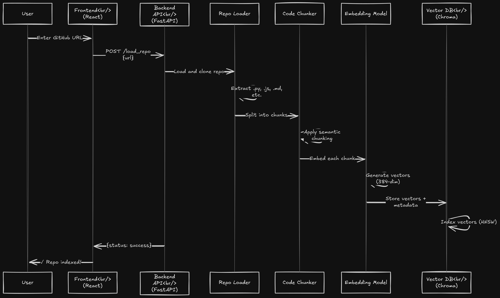
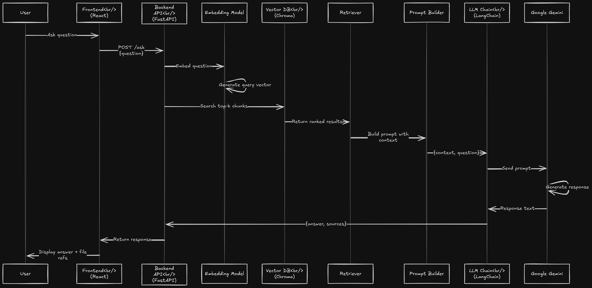
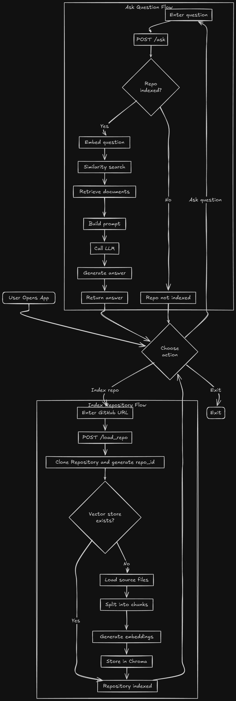
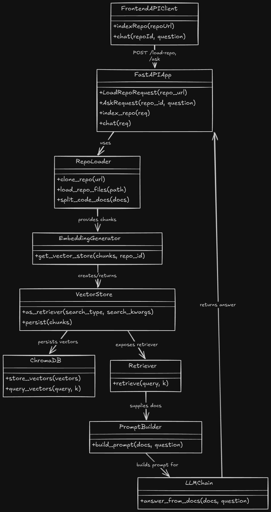

# 📊 Architecture & Design Diagrams

Visual documentation for the GitHub Codebase Assistant project, including system architecture, workflows, and component relationships.

---

## 📁 Available Diagrams

### 1. High-Level Architecture

**File**: `high_level_architecture.png`

<div align="center">
  
</div>

**Description**: Overview of the complete system architecture showing all major components and their interactions.

**Components Shown**:

- React + Vite Frontend
- FastAPI Backend
- Chroma Vector Database
- Google Gemini LLM
- Data flow between components

**Best For**: Executive summaries, project overviews, onboarding new team members

---

### 2. RAG Pipeline Architecture

**File**: `rag_pipeline_architecture.png`

<div align="center">
  
</div>

**Description**: Detailed visualization of the Retrieval-Augmented Generation pipeline from repository ingestion to answer generation.

**Pipeline Stages**:

1. Repository cloning and parsing
2. Document chunking
3. Embedding generation
4. Vector storage and indexing
5. Query processing
6. Semantic retrieval
7. Context augmentation
8. LLM response generation

**Best For**: Understanding RAG workflow, technical deep-dives, architecture reviews

---

### 3. Repository Indexing Sequence

**File**: `indexing_repo.png`

<div align="center">
  
</div>

**Description**: Step-by-step sequence diagram showing how repositories are loaded and indexed.

**API Flow**: `POST /load_repo`

**Process Steps**:

- User submits repository URL
- Backend clones repository
- Files are parsed and filtered
- Documents are chunked
- Embeddings are generated
- Vectors are stored in Chroma
- Cache is updated
- Response sent to frontend

**Best For**: API documentation, understanding backend processes, debugging indexing issues

---

### 4. Chat & Answer Sequence

**File**: `chat_&_answer.png`

<div align="center">
  
</div>

**Description**: Sequence diagram illustrating the question-answering workflow.

**API Flow**: `POST /ask`

**Process Steps**:

- User submits question
- Query is embedded
- Semantic search retrieves relevant chunks
- Context is prepared
- LLM generates answer
- Sources are attributed
- Response sent to frontend

**Best For**: Understanding Q&A flow, API documentation, troubleshooting query issues

---

### 5. Activity Diagram

**File**: `activity_diag.png`

<div align="center">
  
</div>

**Description**: Complete user workflow showing activities, decision points, and system behavior.

**Workflows Covered**:

- User landing and navigation
- Repository loading decision logic
- Question asking process
- Parallel processing activities
- Error handling paths
- Success/failure branches

**Best For**: Understanding user journeys, process documentation, workflow optimization

---

### 6. Class Diagram

**File**: `class_diag.png`

<div align="center">
  
</div>

**Description**: UML class diagram showing the object-oriented structure of the backend system.

**Classes Included**:

- API Routers (`ask_router`, `load_repo_router`)
- Schemas (`AskRequest`, `LoadRequest`)
- Services (`VectorStore`, `LLMChain`, `RepoLoader`)
- Utils (`RetrieverUtils`, `VectorCache`)

**Relationships Shown**:

- Class inheritance
- Dependencies
- Method signatures
- Attributes

**Best For**: Developer onboarding, code structure understanding, refactoring planning

---

### 7. File Structure

**File**: `files_structure.png`

<div align="center">
  
</div>

**Description**: Visual representation of the complete project directory structure.

**Structure Shown**:

- Backend directory organization
- Frontend directory organization
- Configuration files
- Docker files
- Documentation files

**Best For**: Project navigation, understanding organization, locating specific files

---

## 🎨 Diagram Types & Purposes

| Diagram Type            | Files                                        | Purpose                                     |
| ----------------------- | -------------------------------------------- | ------------------------------------------- |
| **Architecture**  | `high_level_architecture.png`              | System overview and component relationships |
| **Flow/Pipeline** | `rag_pipeline_architecture.png`            | Data processing workflows                   |
| **Sequence**      | `indexing_repo.png`, `chat_&_answer.png` | API interactions and temporal flows         |
| **Activity**      | `activity_diag.png`                        | User workflows and decision logic           |
| **Class**         | `class_diag.png`                           | Code structure and OOP design               |
| **Tree**          | `files_structure.png`                      | Project organization                        |

---

## 📖 How to Use These Diagrams

### In Documentation

**Markdown**:

```markdown

```

**HTML with Sizing**:

```html
<div align="center">
  
  <br>
  <em>RAG Pipeline Architecture</em>
</div>
```

### In Presentations

All diagrams are presentation-ready:

- High resolution for projection
- Clear labels and legends
- Consistent color schemes
- Professional appearance

**Use Cases**:

- Technical presentations
- Architecture reviews
- Stakeholder meetings
- Team onboarding
- Documentation

### In Development

Reference diagrams during:

- Feature planning
- Code reviews
- Architecture discussions
- Bug investigation
- Refactoring sessions

---

## 🔄 Updating Diagrams

### When to Update

Update diagrams when:

- ✅ New components are added
- ✅ Architecture changes significantly
- ✅ API endpoints are modified
- ✅ Workflows are redesigned
- ✅ Class structures are refactored
- ✅ File organization changes

### Recommended Tools

**Sequence & Class Diagrams**:

- PlantUML (text-based)
- Mermaid (markdown-friendly)
- StarUML (GUI)

**Architecture Diagrams**:

- draw.io / diagrams.net (free, web-based)
- Lucidchart (professional)
- Excalidraw (hand-drawn style)
- Figma (design-focused)

**Activity Diagrams**:

- draw.io
- Microsoft Visio
- Lucidchart

**General Purpose**:

- Figma
- Adobe Illustrator
- Inkscape (free)

### Creating New Diagrams

**Guidelines**:

1. Use PNG format for compatibility
2. Minimum width: 600px for readability
3. Use consistent color scheme
4. Include clear labels and legends
5. Add to this README with description
6. Follow naming convention: `descriptive_name.png`

---

## 📏 Diagram Specifications

### Technical Details

| Specification         | Standard                        |
| --------------------- | ------------------------------- |
| **Format**      | PNG (Portable Network Graphics) |
| **Color Mode**  | RGB                             |
| **Resolution**  | 72-150 DPI                      |
| **Background**  | White or transparent            |
| **Width Range** | 600-1200px                      |
| **Compression** | Optimized for web               |

### File Naming Convention

```
{description}_{type}.png

Examples:
- high_level_architecture.png
- indexing_repo.png (sequence)
- activity_diag.png
- class_diag.png
```

---

## 📊 Quick Reference Guide

### For New Developers

Start with these diagrams in order:

1. `high_level_architecture.png` - Understand the system
2. `files_structure.png` - Navigate the codebase
3. `rag_pipeline_architecture.png` - Learn the core workflow
4. `class_diag.png` - Understand code organization

### For API Users

Focus on these diagrams:

1. `indexing_repo.png` - How to load repositories
2. `chat_&_answer.png` - How to ask questions
3. `activity_diag.png` - Complete user workflows

### For System Architects

Review these diagrams:

1. `high_level_architecture.png` - System design
2. `rag_pipeline_architecture.png` - Data flow
3. `class_diag.png` - Component structure

### For Frontend Developers

These diagrams are most relevant:

1. `high_level_architecture.png` - Frontend-backend interaction
2. `indexing_repo.png` - `/load_repo` API
3. `chat_&_answer.png` - `/ask` API
4. `activity_diag.png` - User flows

### For Backend Developers

Focus on these diagrams:

1. `class_diag.png` - Code structure
2. `rag_pipeline_architecture.png` - Processing pipeline
3. `indexing_repo.png` - Repository loading
4. `chat_&_answer.png` - Query processing

---

## 📈 Diagram Coverage

### System Components

- ✅ Frontend architecture
- ✅ Backend architecture
- ✅ Database layer
- ✅ External services (LLM, Git)
- ✅ API endpoints
- ✅ Data flow

### Workflows

- ✅ Repository indexing
- ✅ Question answering
- ✅ User interactions
- ✅ Error handling
- ⬜ Authentication (future)
- ⬜ Deployment (future)

### Code Structure

- ✅ Backend classes
- ✅ File organization
- ⬜ Frontend components (future)
- ⬜ Database schema (future)

---

## 🎯 Future Additions

Planned diagrams for future releases:

- [ ] **Deployment Diagram** - Container orchestration and cloud deployment
- [ ] **Database Schema** - Chroma collection structure
- [ ] **Error Handling Flow** - Comprehensive error scenarios
- [ ] **Authentication Flow** - If/when authentication is added
- [ ] **Caching Strategy** - Detailed caching mechanisms
- [ ] **Frontend Component Tree** - React component hierarchy
- [ ] **CI/CD Pipeline** - Build and deployment workflow
- [ ] **Security Architecture** - Security layers and measures
- [ ] **Load Balancing** - Scaling strategy
- [ ] **Monitoring & Logging** - Observability setup

---

## 🤝 Contributing Diagrams

### Contribution Process

1. **Create your diagram** using recommended tools
2. **Export as PNG** with proper resolution
3. **Name appropriately** following conventions
4. **Add to this folder**
5. **Update this README** with description
6. **Submit pull request** with clear explanation

### Quality Checklist

Before submitting:

- [ ] High resolution (minimum 600px width)
- [ ] Clear labels and text
- [ ] Consistent with existing style
- [ ] PNG format
- [ ] Proper filename
- [ ] Added to README
- [ ] Referenced in relevant docs

---

## 📚 Related Documentation

- [Main README](../README.md) - Project overview
- [Backend README](../backend/README.md) - Backend documentation
- [Frontend README](../frontend/README.md) - Frontend documentation
- [API Documentation](http://localhost:8000/docs) - Interactive API docs

---

## 📊 Statistics

| Metric             | Value                                                   |
| ------------------ | ------------------------------------------------------- |
| Total Diagrams     | 7                                                       |
| Diagram Types      | 6 (Architecture, Flow, Sequence, Activity, Class, Tree) |
| Total Size         | ~1.4 MB                                                 |
| Format             | PNG                                                     |
| Average Dimensions | 700x500px                                               |
| Last Updated       | December 2024                                           |

---

## 💡 Reading Guide

### Understanding Sequence Diagrams

- **Vertical Axis**: Time flows from top to bottom
- **Horizontal Boxes**: System components/actors
- **Arrows**: Messages/calls between components
- **Dashed Arrows**: Return values/responses
- **Activation Bars**: Component is actively processing

### Understanding Activity Diagrams

- **Rounded Rectangles**: Activities/actions
- **Diamonds**: Decision points
- **Arrows**: Flow direction
- **Parallel Bars**: Concurrent activities (fork/join)
- **Circles**: Start/end points

### Understanding Class Diagrams

- **Rectangles**: Classes
- **Three Sections**: Class name, attributes, methods
- **Lines with Arrows**: Relationships
  - Solid line: Association
  - Arrow: Dependency
  - Diamond: Composition/Aggregation
  - Triangle: Inheritance
- **+ / - / #**: Public / Private / Protected members

### Understanding Architecture Diagrams

- **Boxes**: System components
- **Arrows**: Data/control flow
- **Colors**: Grouping related components
- **Labels**: Technologies/protocols used
- **Dashed lines**: Optional/external dependencies

---

## 🔍 Troubleshooting

### Can't See Diagrams?

**Issue**: Images not displaying in README

**Solutions**:

- Check file paths are correct
- Ensure PNG files exist in directory
- Verify no typos in filenames
- Try absolute paths if relative fail

### Diagrams Too Small/Large?

**Issue**: Size doesn't fit your needs

**Solutions**:

```html
<!-- Adjust width attribute -->
  <!-- Smaller -->
 <!-- Larger -->
```

### Need Different Format?

**Issue**: Need SVG, PDF, or other format

**Solutions**:

- Convert using online tools
- Re-export from source tool
- Use ImageMagick for conversion:

```bash
convert diagram.png diagram.svg
```

---

## 📞 Questions or Feedback?

For questions about diagrams or suggestions for new ones:

- 📫 Open an issue on GitHub
- 💬 Start a discussion
- 📧 Contact maintainers
- 🔄 Submit a pull request with improvements

---

<div align="center">
  <p><em>Visual documentation for better understanding 📊</em></p>
  <p><strong>Keep diagrams updated as the project evolves</strong></p>
  <br>
  <p>Last Updated: December 2025</p>
</div>
